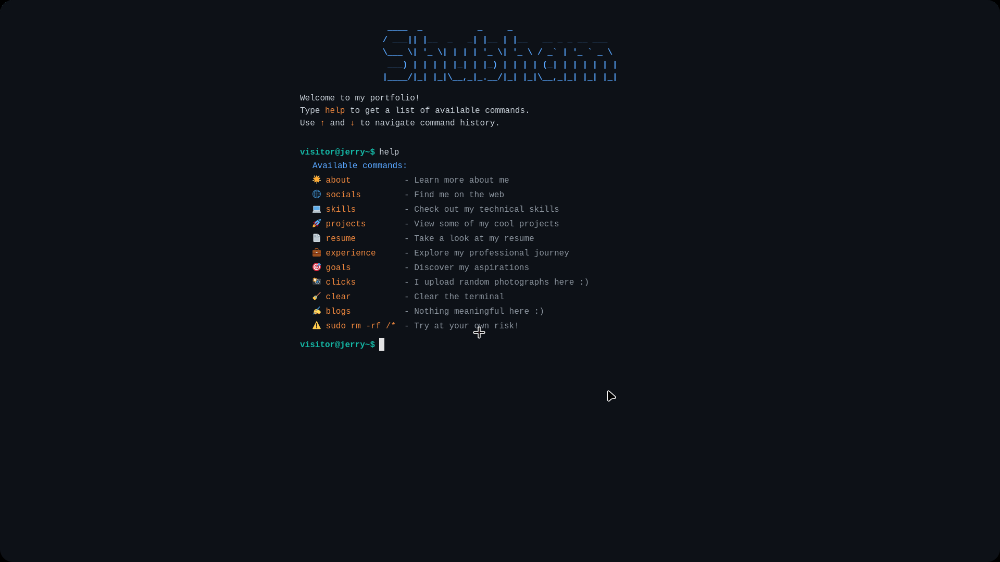

# 🖥️ Srikant Pandey - Terminal Portfolio

A modern, interactive terminal-style portfolio website built with React, TypeScript, and Tailwind CSS. Experience my professional journey through a nostalgic command-line interface.



## ✨ Features

### 🎯 Interactive Terminal Experience
- **Command-line interface** with real-time command processing
- **Command history** navigation using arrow keys
- **Auto-completion** for commands with Tab key
- **Responsive design** that works on all devices

### 🚀 Available Commands
- `about` - Learn more about me and my background
- `socials` - Find me on social media platforms
- `skills` - View my technical skills and expertise
- `projects` - Explore my AI and development projects
- `experience` - Check out my professional journey
- `resume` - Download my resume
- `goals` - Discover my aspirations and interests
- `clear` - Clear the terminal
- `help` - Show all available commands

### 🎨 Modern Design
- **Dark theme** with GitHub-inspired color scheme
- **Smooth animations** and transitions
- **Typography** optimized for readability
- **Gradient effects** and visual enhancements

## 🛠️ Tech Stack

### Frontend
- **React 18** - Modern UI library
- **TypeScript** - Type-safe development
- **Tailwind CSS** - Utility-first styling
- **React Icons** - Beautiful icon library

### Development Tools
- **Create React App** - Project scaffolding
- **npm** - Package management
- **ESLint** - Code linting
- **Webpack** - Module bundling

## 🚀 Getting Started

### Prerequisites
- Node.js (version 14 or higher)
- npm or yarn package manager

### Installation

1. **Clone the repository**
   ```bash
   git clone https://github.com/deltacoder2603/terminal-portfolio.git
   cd terminal-portfolio
   ```

2. **Install dependencies**
   ```bash
   npm install
   ```

3. **Start the development server**
   ```bash
   npm start
   ```

4. **Open your browser**
   Navigate to `http://localhost:3000`

### Build for Production

```bash
npm run build
```

## 📁 Project Structure

```
terminal-portfolio/
├── public/
│   ├── index.html
│   ├── resume.pdf
│   └── favicon.ico
├── src/
│   ├── components/
│   │   ├── header.tsx
│   │   ├── terminal.tsx
│   │   └── command-area.tsx
│   ├── utils/
│   │   ├── commands.tsx
│   │   └── keybindings.tsx
│   ├── App.tsx
│   └── index.tsx
├── package.json
└── tailwind.config.js
```

## 🎮 How to Use

### Terminal Commands
- Type commands in the input field and press Enter
- Use `↑` and `↓` arrow keys to navigate command history
- Press `Tab` for command auto-completion
- Type `help` to see all available commands

### Navigation
- **Arrow Keys**: Navigate through command history
- **Tab**: Auto-complete commands
- **Enter**: Execute commands
- **Clear**: Type `clear` to reset the terminal

## 🎨 Customization

### Personal Information
Update your details in `src/utils/commands.tsx`:
- Name and personal information
- Social media links
- Skills and experience
- Project details

### Styling
Modify the theme in:
- `tailwind.config.js` - Color scheme and design tokens
- `src/App.css` - Custom styles
- Component files for specific styling

### Adding New Commands
1. Add the command case in `src/utils/commands.tsx`
2. Update the help command with the new option
3. Add auto-completion in `src/utils/keybindings.tsx`

## 🌟 Key Features

### AI Projects Showcase
- **Derplexity** - AI-powered search summarizer
- **GitMaster** - GitHub repository assistant
- **AyurvedaAI** - Ayurvedic remedy assistant
- **Stock Price Predictor** - ML-based predictions
- **AI Tutor** - Multi-agent subject assistant
- **AI Web Developer** - Work in progress
- **Canva AI** - AI-powered design assistant
- **Video Editor** - AI video processing platform

### Professional Experience
- **Junior AI Engineer** at Idiotic Media
- **Technical Lead** at E-Cell PSIT
- **Frontend Development Intern** at Codekid

## 🎯 Skills Highlighted

### Core Technologies
- JavaScript/TypeScript
- Python
- React/Next.js
- Node.js

### AI & Agentic Systems
- Gemini API
- Multi-Agent Architecture
- Prompt Engineering
- Agentic Frameworks

### Specialized Skills
- Real-time Data Processing
- System Architecture
- Full-Stack Development
- Web Scraping & RESTful APIs

## 📱 Responsive Design

The portfolio is fully responsive and works seamlessly on:
- Desktop computers
- Tablets
- Mobile devices
- Different screen sizes

## 🚀 Deployment

### Vercel (Recommended)
1. Connect your GitHub repository to Vercel
2. Deploy automatically on push to main branch
3. Custom domain support available

### Netlify
1. Build the project: `npm run build`
2. Upload the `build` folder to Netlify
3. Configure custom domain if needed

### GitHub Pages
1. Add `homepage` field to `package.json`
2. Install `gh-pages`: `npm install --save-dev gh-pages`
3. Add deploy script and deploy

## 🤝 Contributing

1. Fork the repository
2. Create a feature branch: `git checkout -b feature-name`
3. Commit your changes: `git commit -m 'Add feature'`
4. Push to the branch: `git push origin feature-name`
5. Submit a pull request

## 📄 License

This project is licensed under the MIT License - see the [LICENSE](LICENSE) file for details.

## 🙏 Acknowledgments

- Inspired by terminal interfaces and command-line tools
- Built with modern web technologies
- Designed for developer experience

## 📞 Contact

- **GitHub**: [@deltacoder2603](https://github.com/deltacoder2603)
- **LinkedIn**: [Srikant Pandey](https://www.linkedin.com/in/srikant-pandey-b55935209/)
- **Email**: srisrikantpandey@gmail.com
- **Twitter**: [@DeltaPandey2603](https://x.com/DeltaPandey2603)

---

⭐ **Star this repository if you found it helpful!**
